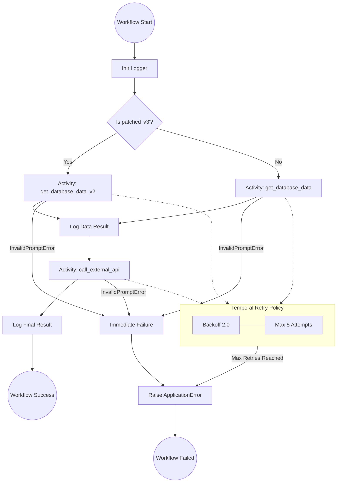

# Temporal.io x LLM: Enterprise-Ready AI Orchestration

This project demonstrates how to build resilient, production-grade AI workflows using **Temporal.io** and **fake LLM for exemple**. It focuses on overcoming common distributed systems challenges: API instability, long-running processes, and seamless code versioning.

## Key Features
- **Durable Execution**: Workflows resume automatically after server or network failures.
- **Resilient AI Calls**: Integrated retry policies for LLM API to handle rate limits (429) and timeouts.
- **Safe Versioning**: Demonstrates `workflow.patched` for zero-downtime updates.
- **Clean Architecture**: Separation of concerns between Workflows (orchestration) and Activities (business logic).

---


# Temporal.io

Temporal is an open-source platform that simplifies the development of reliable and resilient distributed applications.

## The Core Concept

Temporal lets you write complex code (workflows, asynchronous tasks, orchestrations) as if it were simple sequential code, while automatically handling typical distributed system problems: failures, retries, timeouts, intermediate states, etc.

**What Temporal handles automatically:**
- ✅ Retries on failure
- ✅ State persistence
- ✅ Recovery from crashes
- ✅ Timeouts
- ✅ Visibility and monitoring

## Typical Use Cases

- **Microservices orchestration**: coordinate multiple services to accomplish complex business processes
- **Payment processing**: manage transactions with automatic retries and failure handling
- **Data pipelines**: orchestrate long-running ETL or data transformations
- **Business processes**: user onboarding, order validation, approval workflows

## Key Benefits

**Reliability**: Temporal guarantees your workflows run to completion, even through server crashes, restarts, or deployments.

**Simplicity**: You write standard imperative code (no complex state machines or manual message queue management).

**Observability**: Web UI to visualize the state of all your running or completed workflows.

**Scalability**: Handles millions of concurrent workflows.

---

# Starter Kit

## Project Structure

This layout follows Python best practices for Temporal projects, ensuring scalability and ease of testing.

```text
.
├── src/
|   |── worker_simple
│   │   ├── activities/
│   │   │   ├── __init__.py
│   │   │   └── activities.py              # AI-related activities
│   │   ├── api/
│   │   │   ├── __init__.py
│   │   │   ├── call_llm.py                # External call example
│   │   ├── config/
│   │   │   ├── __init__.py
│   │   │   ├── DefaultSettings.py         # Project variables
│   │   ├── logs/
│   │   │   ├── __init__.py
│   │   │   ├── log_config.py              # Logger configuration
│   │   │   ├── logger.py
│   │   ├── workflows/
│   │   │   ├── __init__.py
│   │   │   └── genai_workflow.py          # Workflow definitions & orchestration
│   │   ├── main_simple_worker.py          # The Worker (The execution engine)
│   │   └── shared.py                      # Common constants and data models
│   ├── main_simple_workflow.py            # Workflow requested from application side
├── tests/                                 # Unit and integration tests
├── .env.example                           # Environment variables template
├── pyproject.toml
└── README.md
```

Workflows  

Worker Simple (Call fake DB and call fake LLM)


## Prerequisites & Setup


### Available Variables

| Alias |      Python Field      |    Default     | Description |       |
|-------|:----------------------:|:--------------:|:-----------:|--:    |
|   CUSTOM_LOGGING    |    activate_logging    |     false      |      workflow logging       |       |
|   APP_VERSION    |      app_version       |      dev       |   Current application version          |       |
|   LLM_CALL_URL    |      llm_call_url      |   http://...   |   Endpoint for the LLM API          |       |
|   LLM_CALL_TIMEOUT    |    llm_call_timeout    |      180       |    Timeout in seconds for API calls         |       |
|   TEMPORAL_SERVER_URL    |  temporal_server_url   | localhost:7233 |  Temporal cluster address           |       |
|   TEMPORAL_SERVER_BEARER    | temporal_server_bearer |     ******     |   Bearer token for authentication          |       |
|   TEMPORAL_SERVER_TLS    |  temporal_server_tls   |     False      |   Enable/Disable TLS encryption          |       |

### Self-Hosted Temporal Server

### Download the cli and add it to you PATH

#### Running the Application

To run this project, you need to open *three* separate terminals:
1. Start the Temporal Server

This launches the local development server with the Web UI.
Bash

    temporal server start-dev

    Web UI: http://localhost:8233

Once your server is running, visit the Temporal Web UI at http://localhost:8233. You can inspect:

- The full history of your AI workflows.
- Real-time retries of failing Gemini calls.
- Input/Output data for every step.

2. Start the Worker

The Worker listens for tasks and executes the Activities and Workflows.
Bash

    python src/worker_simple/main_simple_worker.py

3. Execute the Workflow

This script triggers a workflow execution from the client side.
Bash

    python src/main_simple_workflow.py

### Deployment & Versioning (Patching)

This project demonstrates Zero-Downtime Deployment using Temporal's patching system.
How it works:

When updating the database logic from v1 to v2, we use workflow.patched("v3").

    Existing Workflows: Continue using the old logic (get_database_data) to ensure deterministic replay.

    New Workflows: Automatically follow the new logic (get_database_data_v2).

Removing Patches:

Once all old workflows are completed, you can safely "deprecate" the patch to clean up the code:
Python

    workflow.deprecate_patch("v3")
    # You can now remove the 'else' branch safely

### Testing

This project uses pytest and pytest-asyncio along with Temporal's testing SDK.
Bash

    # Run all tests
    pytest


